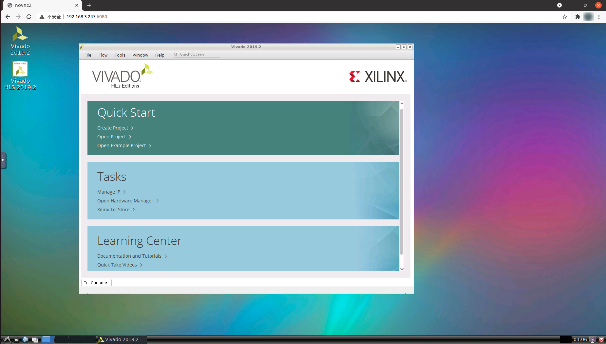

== 构建docker镜像

请自行下载Xilinx_Vivado_2019.2_1106_2127.tar.gz文件并放到dl_dir文件夹中。

请将自己的许可证文件命名为Xilinx.lic并放到build_dir文件夹。

[source,bash]
----
$ cd dl_dir
$ python3 -m http.server 5000
----

[NOTE]
====
可修改build_dir/install_config.txt中的配置选择安装的vivado组件。
====

[source,bash]
----
$ cd build_dir
$ docker build --build-arg VIVADO_TAR_HOST=http://hostip:5000 --build-arg VIVADO_TAR_FILE=Xilinx_Vivado_2019.2_1106_2127 -t vivado2019_2 .
----

== 启动容器vnc/novnc登录 

[source,bash]
----
$ docker run -u root -p 6080:80 -p 5900:5900 -e USER=vivado -v /dev/shm:/dev/shm vivado2019_2
----

vnc登录的端口是5900

novnc登录端口为6080，直接浏览器访问ip:6080，如果容器在本机上运行，访问 http://127.0.0.1:6080 ，如果容器是在服务器上，访问 http://serverip:6080

== 挂在当前目录到容器内

[source,bash]
----
$ docker run -u root -v $(pwd):/home/vivado/workspace -p 6080:80 -p 5900:5900 -e USER=vivado -v /dev/shm:/dev/shm vivado2019_2
----

== 挂在当前目录 exec模式编译

[source,bash]
----
$ docker run --rm -v $(pwd):/home/vivado/workspace --entrypoint "vivado" vivado2019_2 -version
$ docker run --rm -v $(pwd):/home/vivado/workspace --entrypoint "make" vivado2019_2 -version
$ docker run --rm -v $(pwd):/home/vivado/workspace --entrypoint "/bin/bash" vivado2019_2 XXXX
----

== 进入容器内shell

[source,bash]
----

----
